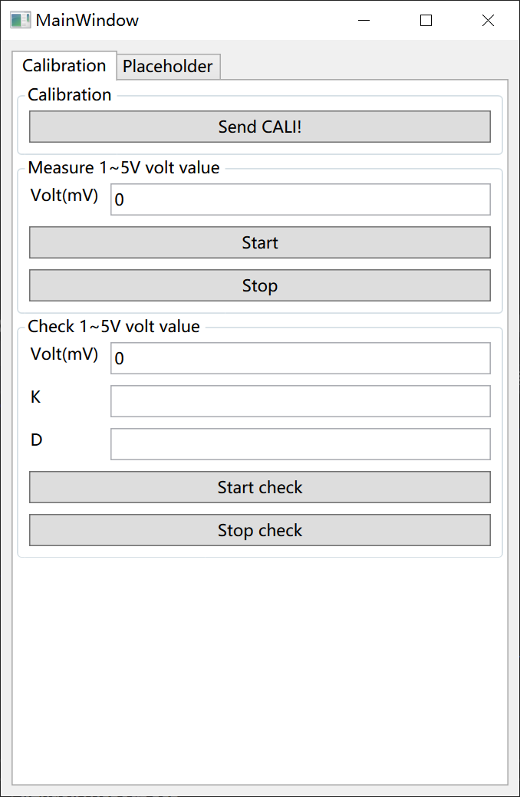

# AutoUIDemo

## Add UIAuto Section Definition
Add custom AutoUISection to configSections node of configuration file
```xml
<configSections>
    <section name="UIAuto" type="AutoUIDemo.UIAuto.UIAutoSection,AutoUIDemo"/>
</configSections>
```
### Add UIAuto Section Configuration
Add custom UIAuto node to configuration node, like this:
```xml
  <UIAuto>
    <Tabs>
      <Tab Header="Calibration">
        <Groups>
          <Group Header="Calibration">
            <Commands>
              <Command Name="CaliCommand" Description="Cali Command">
                <Actions>
                  <Action Name="CaliAction" Description="Send CALI!" Format="CALI!"></Action>
                </Actions>
              </Command>
            </Commands>
          </Group>
          <Group Header="Measure 1~5V volt value">
            <Commands>
              <Command Name="AvstartCommand" Description="AvStart Command">
                <Parameters>
                  <Parameter Name="Volt" Description="Volt(mV)" Type="float" DefaultValue="0"></Parameter>
                </Parameters>
                <Actions>
                  <Action Name="Start" Description="Start" Format="AV_START:{Volt}!"></Action>
                  <Action Name="Stop" Description="Stop" Format="AV_STOP!"></Action>
                </Actions>
              </Command>
            </Commands>
          </Group>
          <Group Header="Check 1~5V volt value">
            <Commands>
              <Command Name="CheckVoltCommand" Description="Check Volt">
                <Parameters>
                  <Parameter Name="Volt" Description="Volt(mV)" Type="float" DefaultValue="0"></Parameter>
                  <Parameter Name="K" Description="K" Type="float"></Parameter>
                  <Parameter Name="D" Description="D" Type="float"></Parameter>
                </Parameters>
                <Actions>
                  <Action Name="Start" Description="Start check" Format="AI_START:{Volt};{K};{D}!"></Action>
                  <Action Name="Stop" Description="Stop check" Format="CHECK_STOP!"></Action>
                </Actions>
              </Command>
            </Commands>
          </Group>
        </Groups>
      </Tab>
      <Tab Header="Placeholder">
        <Groups>
          <Group Header="Placeholder">
            <Commands>
              <Command Name="PlaceholderCommand" Description="Placeholder command">
                <Parameters>
                  <Parameter Name="Location1" Description="Location 1" Type="float"></Parameter>
                  <Parameter Name="Location2" Description="Location 2" Type="float"></Parameter>
                  <Parameter Name="Location3" Description="Location 3" Type="float"></Parameter>
                </Parameters>
              </Command>
            </Commands>
          </Group>
        </Groups>
      </Tab>
    </Tabs>
  </UIAuto>
```
## Run Execution
Run and see.

